<p align="center">
  
</p>

<h1 align="center">Open Emirates Intelligence</h1>

<p align="center"><strong>The Emirates, queryable.</strong></p>

<p align="center">
  <a href="https://uaemcp.zad.tools"></a>
  <a href="https://github.com/zad-tools/uaemcp/actions/workflows/ci.yml"></a>
  <a href="https://www.npmjs.com/package/uaemcp"></a>
  
  
</p>

<p align="center">Official UAE open data for agents, researchers and builders—over MCP, REST, vector maps and six SDKs.</p>

<p align="center">
  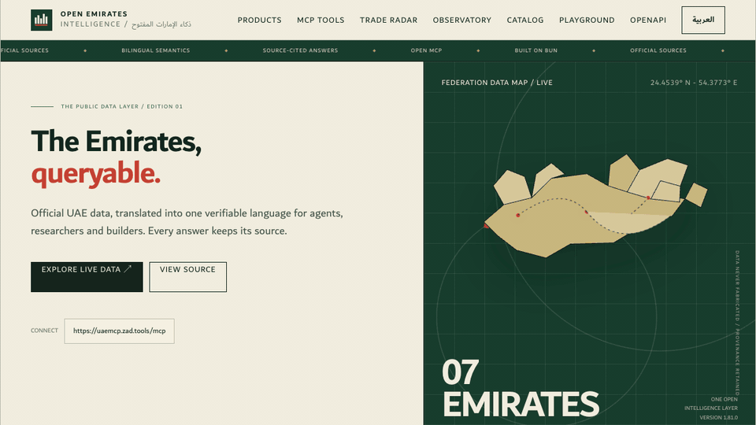
</p>

<p align="center">
  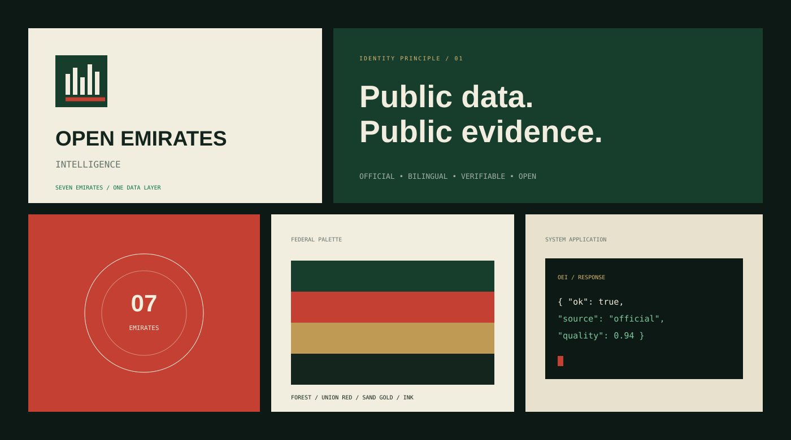
</p>

<table>
  <tr>
    <td width="68%">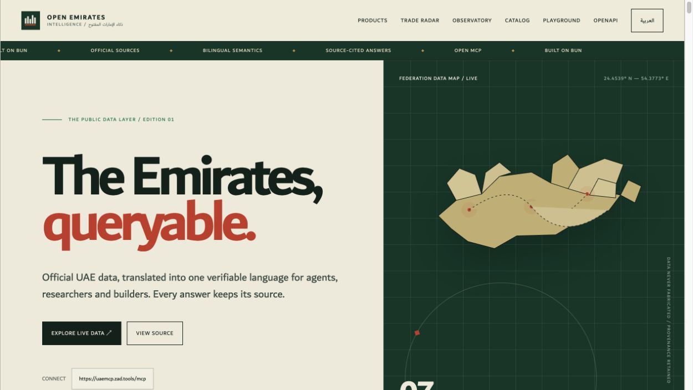</td>
    <td width="32%">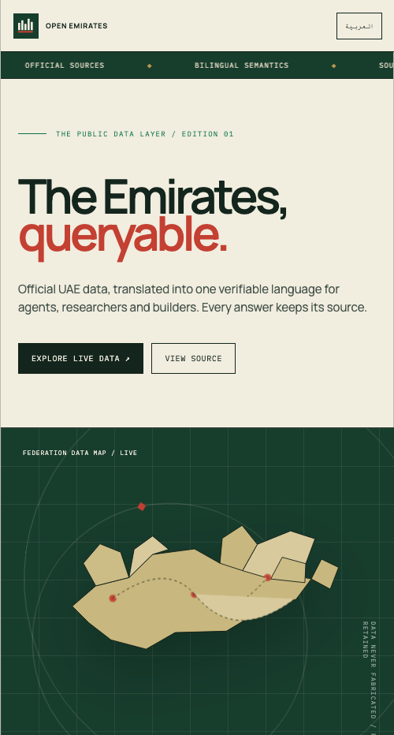</td>
  </tr>
</table>

<p align="center">
  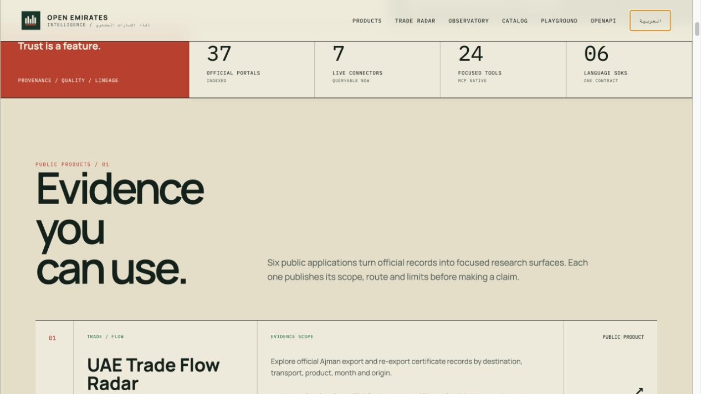
</p>

<p align="center">
  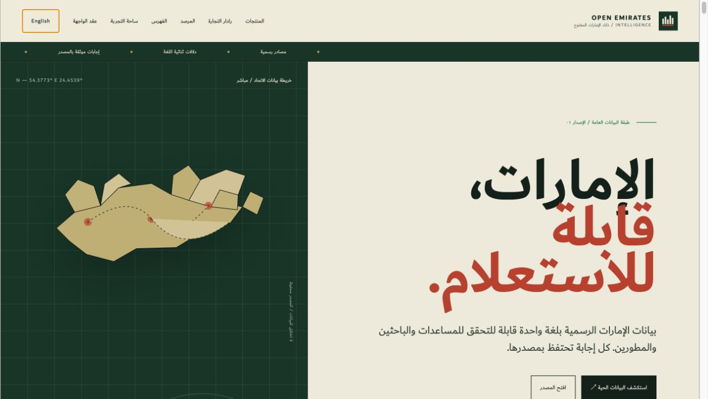
</p>

Maintained by **Ahmed Morsy**. Released under the MIT license and built on the
original open-source UAEMCP work credited in [LICENSE](LICENSE).

Open Emirates is an independent open-source initiative. It is not affiliated
with or endorsed by the UAE Government. Every data product identifies its
official source, evidence boundary, retrieval date and available licence terms.

## Independent packages

The repository is now a monorepo with separate release lines:

- `@open-emirates/contracts` for dependency-free response contracts.
- `@open-emirates/sdk` for a hybrid TypeScript client with generated tool types,
  runtime Schema 2.1 discovery, local validation, bounded retries and pagination.
- `@open-emirates/mcp` for the MCP stdio and Streamable HTTP entry point.
- `uaemcp` remains the compatible engine and existing CLI during migration.

The SDK has no MCP dependency. Package boundaries and publishing instructions
are documented in [docs/PACKAGES.md](docs/PACKAGES.md).

```ts
import { OpenEmiratesClient } from "@open-emirates/sdk";

const client = new OpenEmiratesClient();
const result = await client.tools.call("uae_golden_residency", { action: "list" });
```

Known tools receive compile-time autocomplete; newer server tools remain callable
through dynamic discovery. Golden Residency output is informational official-route
guidance, not an eligibility or residence decision.

<p align="center">
  
</p>

The server keeps the public `uaemcp` contract and extends it to 43 source-cited
MCP tools, seventeen resources, three prompts, bilingual catalog search, CKAN,
OpenDataSoft, ArcGIS, Socrata, JSON, CSV, XLSX, XML, RSS, GraphQL, SDMX and
SPARQL connectors, geo queries,
aggregation, PII redaction, SSRF protection, and
health/readiness/Prometheus endpoints. Bun SQLite stores health history and
bounded dataset snapshots for repeatable comparisons.

The public gateway is fully bilingual: navigation, product evidence, catalog,
connectors, dataset discovery, playground controls and runtime states switch
between English and Arabic. Every public application uses Dubai Font with native
RTL composition.

<p align="center">
  <a href="https://uaemcp.zad.tools/employment-gender"></a>
</p>

The **MOHRE Employment by Gender** ledger publishes ten validated annual ratio
observations for employees registered in MOHRE private-sector systems from
2020–2024. It keeps male and female shares separate, never converts ratios into
employee counts, and does not claim whole-workforce coverage, pay equity,
causality or forecasts. Use the
[hosted ledger](https://uaemcp.zad.tools/employment-gender),
`GET /api/v1/employment-gender`, or the `uae_employment_gender` MCP tool.

<p align="center">
  <a href="https://uaemcp.zad.tools/tourism-pulse"></a>
</p>

The **UAE Tourism Pulse** presents five official national annual aggregates as
separate source-native series with metric and year-range filters. Guest counts
are not presented as unique tourists, year-to-year movement is descriptive—not
causal—and occupancy is transparently displayed as a percentage by multiplying
the published source fraction by 100. It does not create a tourism score or
infer emirate, hotel, traveller or market-segment detail. Use the
[hosted pulse](https://uaemcp.zad.tools/tourism-pulse),
`GET /api/v1/tourism-pulse`, or the `uae_tourism_pulse` MCP tool.

<p align="center">
  <a href="https://uaemcp.zad.tools/aeronautical-publications"></a>
</p>

The **UAE Aeronautical Publications** ledger reads the current GCAA eAIP
publication index and keeps each package, publication and effective date tied to
its source description. AIRAC amendments and supplements can be filtered
without interpreting regulatory effect, airspace, routes or safety. This is a
discovery index—not NOTAM, flight-planning guidance or a substitute for the
current official AIP package. Use the
[hosted ledger](https://uaemcp.zad.tools/aeronautical-publications),
`GET /api/v1/aeronautical-publications`, or the
`uae_aeronautical_publications` MCP tool.

<p align="center">
  <a href="https://uaemcp.zad.tools/health-facilities-map">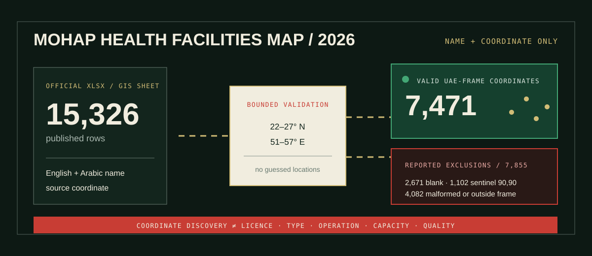</a>
</p>

The **UAE Health Facilities Map** exposes the second GIS sheet in MOHAP's
official 2026 workbook: 15,326 published rows, of which 7,471 contain
coordinates inside a conservative UAE frame. It reports and excludes the other
7,855 rows—2,671 blank coordinates, 1,102 `90,90` sentinels and 4,082 malformed
or out-of-frame values—instead of guessing locations. Names and coordinates do
not establish facility type, licence, ownership, current operation, services,
capacity, accessibility or quality. Use the
[hosted map](https://uaemcp.zad.tools/health-facilities-map),
`GET /api/v1/health-facilities-map`, or `uae_health_facilities_map`.

<p align="center">
  <a href="https://uaemcp.zad.tools/connectivity"></a>
</p>

The **UAE Connectivity Pulse** publishes three separate official TDRA monthly
series from January 2011 through December 2025: active mobile subscriptions,
broadband internet subscriptions per 100 inhabitants, and fixed lines per 100
inhabitants. It does not add unlike units or create a connectivity score.
Subscriptions are not unique people, and per-100 observations do not measure
coverage, speed, quality, affordability or digital inclusion. Use the
[hosted ledger](https://uaemcp.zad.tools/connectivity), REST, or the
`uae_connectivity_pulse` MCP tool.

<p align="center">
  <a href="https://uaemcp.zad.tools/ajman-parks"></a>
</p>

The **Ajman Parks Footfall** product reads the complete official 2017–2023
monthly observation dataset, groups valid published visits by year and
source-native park label, and exposes malformed exclusions. Visits are never
presented as unique people, resident demand, tourism performance, satisfaction,
capacity or park quality. Use the
[hosted explorer](https://uaemcp.zad.tools/ajman-parks), REST, or the
`uae_ajman_parks_footfall` MCP tool.

<p align="center">
  <a href="https://uaemcp.zad.tools/policy-watch"></a>
</p>

The **UAE Policy Evidence Watch** checks five audited official legislation,
resolution and announcement surfaces. It retains SHA-256 fingerprints, bounded
excerpts and check observations—not full government pages. A detected page
content change is evidence for review; it is never presented as a legal change,
effective date or eligibility decision. Use the
[hosted watch](https://uaemcp.zad.tools/policy-watch), REST, or the
`uae_policy_evidence_watch` MCP tool.

<p align="center">
  <a href="https://uaemcp.zad.tools/evidence-studio">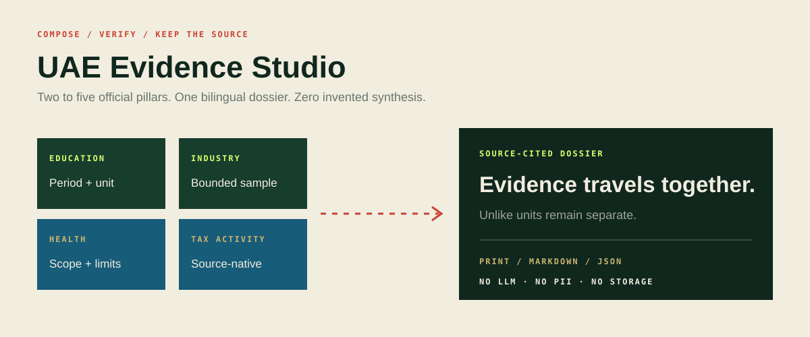</a>
</p>

The **UAE Evidence Studio** turns two to five existing official evidence pillars
into one bilingual research dossier. Every card keeps its period, unit, scope,
delivery mode, citation and limitations. It uses no generative model, stores no
question or selection, and never adds unlike units, ranks pillars or invents a
composite score. Use the [hosted studio](https://uaemcp.zad.tools/evidence-studio),
`POST /api/v1/evidence-dossier`, or the `uae_evidence_dossier` MCP tool; print or
download Markdown and JSON locally in the browser.

<p align="center">
  <a href="https://uaemcp.zad.tools/national-brief"></a>
</p>

The **UAE National Evidence Brief** brings education, health, industry and FTA
service activity into one evidence surface while keeping each source's original
period, unit and limitations. It never adds the pillars together, ranks them or
invents a composite national score. Use the [hosted page](https://uaemcp.zad.tools/national-brief),
the REST endpoint, or the `uae_national_evidence_brief` MCP tool. See the
[MCP client setup guide](docs/MCP_CLIENTS.md) for tested connection patterns.

<p align="center">
  <a href="https://uaemcp.zad.tools/health-facilities"></a>
</p>

The **UAE Health Facilities Atlas** exposes 950 official MOHAP aggregate rows
covering 2015–2024, all seven emirates, government/private sectors and 42 raw
facility-type labels. The default 2024 slice contains 120 rows and a reported
count of 7,392. These are not individual facility locations, beds, capacity,
workforce, accessibility or quality measurements. Use the
[hosted atlas](https://uaemcp.zad.tools/health-facilities), REST, or
`uae_health_facilities_atlas`.

<p align="center">
  <a href="https://uaemcp.zad.tools/founder-pathway">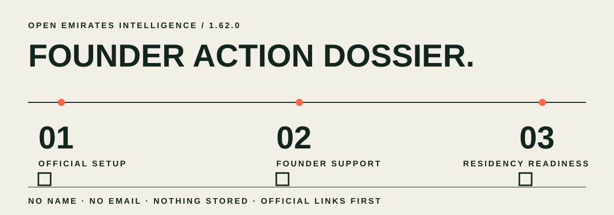</a>
</p>

The **UAE Founder Pathway** composes three evidence products into one ordered,
privacy-bounded action dossier: route to the competent setup authority, discover
relevant government-backed support, then prepare entrepreneur Golden Residency
evidence. Every task links to its official action, starts honestly as not begun,
and can be checked in-memory, printed or downloaded as JSON without sending the
checklist state to the server. It is planning—not licensing, programme acceptance
or an eligibility decision.

<p align="center">
  <a href="https://uaemcp.zad.tools/business-setup">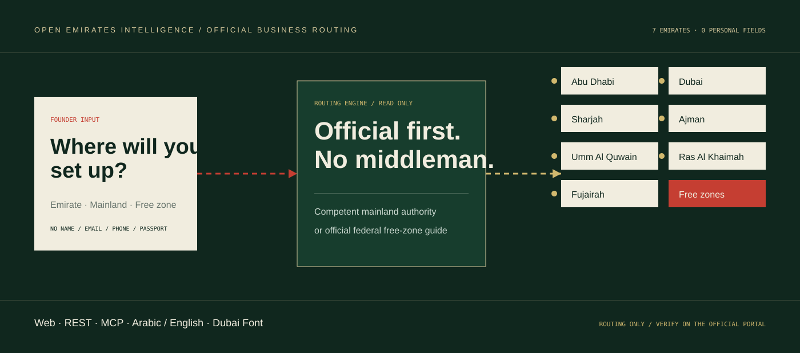</a>
</p>

<p align="center">
  <a href="https://uaemcp.zad.tools/startup-support"></a>
</p>

The **UAE Startup Support Navigator** matches a founder's current stage, support
need and location preference against nine official or government-backed
programmes. It sends no name, email, phone, financial data, pitch deck or
passport details, and treats every match as discovery—not eligibility,
acceptance or funding approval.

The **UAE Business Setup Navigator** routes founders to the competent official
mainland authority or federal free-zone directory across all seven emirates. It
does not collect names, phone numbers, emails or passport data, and never
pretends to choose a licence, calculate final fees or guarantee approval.

<p align="center">
  <a href="https://uaemcp.zad.tools/ajman-business">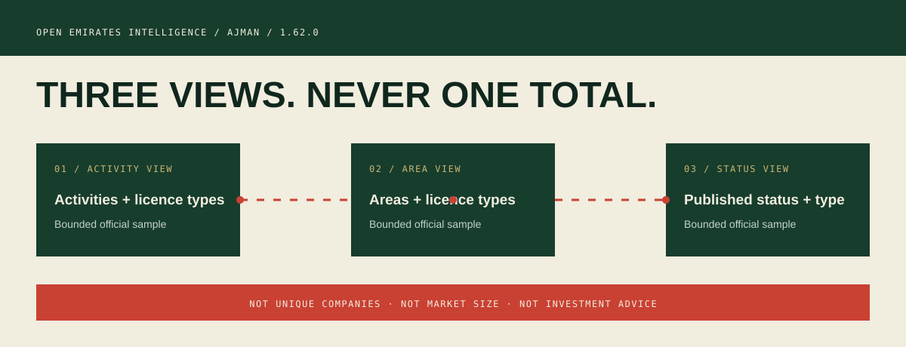</a>
</p>

The **Ajman Business Evidence Explorer** turns three large official open-data
views into bounded rankings for activities, areas, licence types and published
status. It keeps every dataset separate: sampled rows are not added together as
unique companies, market size, survival or investment performance.

<p align="center">
  <a href="https://uaemcp.zad.tools/ajman-urban"></a>
</p>

The **Ajman Urban Evidence Explorer** publishes bounded observations from six official building, certified
rent-contract and road datasets as separate source-native annual series. Units
never collapse into a composite property score, investment return or growth
claim.

## Hosted endpoint

```json
{
  "mcpServers": {
    "uae-intelligence": {
      "type": "http",
      "url": "https://uaemcp.zad.tools/mcp"
    }
  }
}
```

## Run with Bun

Requires Bun 1.3 or newer.

The signed npm package is published from GitHub Actions through npm Trusted
Publishing, with provenance and no long-lived release token:

```bash
bunx --bun uaemcp@latest --version
bunx --bun uaemcp@latest doctor
bunx --bun uaemcp@latest       # stdio MCP server
bunx --bun uaemcp@latest http  # HTTP server at /mcp
```

The npm badge at the top of this README is the authoritative registry version.

MCP client configuration:

```json
{
  "mcpServers": {
    "uae-intelligence": {
      "command": "bunx",
      "args": ["--bun", "uaemcp@latest"]
    }
  }
}
```

From source:

```bash
bun install
bun src/index.ts stdio
```

## Run the signed container

Prebuilt `linux/amd64` and `linux/arm64` images are published to GitHub Container
Registry with an SBOM and build provenance:

```bash
docker run --rm -p 127.0.0.1:8080:8080 \
  -e UAEMCP_ALLOWED_HOSTS=127.0.0.1,localhost \
  ghcr.io/zad-tools/uaemcp:edge
```

Or use the hardened registry Compose file with a persistent SQLite volume,
read-only root filesystem, dropped Linux capabilities and no-new-privileges:

```bash
docker compose -f compose.ghcr.yml up -d
curl http://127.0.0.1:8080/ready
```

Release tags such as `:1.83.1` and `:latest` are produced from verified Git tags;
`:edge` tracks the tested `main` branch.

The installed CLI also provides deployment diagnostics and shell completion:

```bash
uaemcp doctor
source <(uaemcp completion zsh)
uaemcp --help
```

For Streamable HTTP:

```bash
bun src/index.ts http --host 0.0.0.0 --port 8080
```

Endpoints:

- MCP: `POST /mcp`
- Liveness: `GET /health` or `/healthz`
- Readiness: `GET /ready` or `/readyz`
- Prometheus metrics: `GET /metrics`
- REST API: `GET /api/v1/sources`, `/api/v1/search`, and source capability routes
- Vector maps: `GET /api/v1/sources/{sourceId}/tilejson` and `/tiles/{z}/{x}/{y}.pbf`
- Public Observatory: `GET /observatory` — source reliability, incidents and evidence reports
- UAE Policy Evidence Watch: `GET /policy-watch` — retained hashes, bounded excerpts and change observations for five audited official surfaces; API at `GET /api/v1/policy-watch` and bounded checks at `POST /api/v1/policy-watch/check`
- UAE Evidence Studio: `GET /evidence-studio` — compose two to five official evidence pillars into a source-cited dossier; API at `POST /api/v1/evidence-dossier`
- UAE Founder Pathway: `GET /founder-pathway` — build, track, print and export a privacy-bounded action dossier across official setup, startup support and entrepreneur residency readiness
- UAE Startup Support Navigator: `GET /startup-support` — privacy-first matching across nine official or government-backed support programmes by stage, support need and emirate
- UAE Industry Atlas: `GET /industry-atlas` — bounded industrial-establishment evidence by emirate, area and product label
- UAE Trade Flow Radar: `GET /trade-flow` — bounded Ajman 2023 certificate-of-origin evidence by destination, transport, product code and origin
- Ajman Business Evidence: `GET /ajman-business` — three separately ranked official licence-data views with bounded sampling, citations and explicit non-market limitations
- Ajman Urban Evidence: `GET /ajman-urban` — six separate building, certified-rent and road series in source-native units with no composite score
- Ajman Parks Footfall: `GET /ajman-parks` — official 2017–2023 monthly park-visit observations with complete pagination and a visits-not-people boundary; API at `GET /api/v1/ajman-parks`
- UAE Tax Service Activity: `GET /tax-services` — official FTA 2025 service-activity totals and quarterly evidence, explicitly not revenue or taxpayer counts
- FTA Archive Explorer: `GET /tax-services/archive` — source-native 2017–2022, 2024 and 2025 workbooks with comparison disabled when scopes are incompatible
- UAE Place Names Explorer: `GET /places` — normalized bilingual official place-name search and mapped FGIC evidence; API at `GET /api/v1/places`
- UAE Health Indicators: `GET /health-indicators` — 111 official MOHAP indicator rows with source-native 2016–2023 series and explicit scale limitations
- UAE Health Facilities Atlas: `GET /health-facilities` — 950 aggregate MOHAP rows for 2015–2024, explicitly not a facility directory, beds, capacity or quality
- UAE Education Ledger: `GET /education` — FCSC-accredited 2023/2024 national totals, reconciliation checks and the separate seven-resource Ministry of Education catalogue
- UAE Golden Residency Navigator: `GET /golden-residency` — 14 official routes with direct category pages at ICP/GDRFA/ADRO, federal-vs-local criteria warnings and a printable non-identifying readiness dossier

<p align="center">
  <a href="https://uaemcp.zad.tools/golden-residency"></a>
</p>
- Industrial Change Monitor: `GET /api/v1/industry-atlas/change` — compares the two latest different retained samples; unchanged checks are deduplicated and sample movement is never described as economic growth

<table>
  <tr>
    <td width="68%"><a href="https://uaemcp.zad.tools/golden-residency">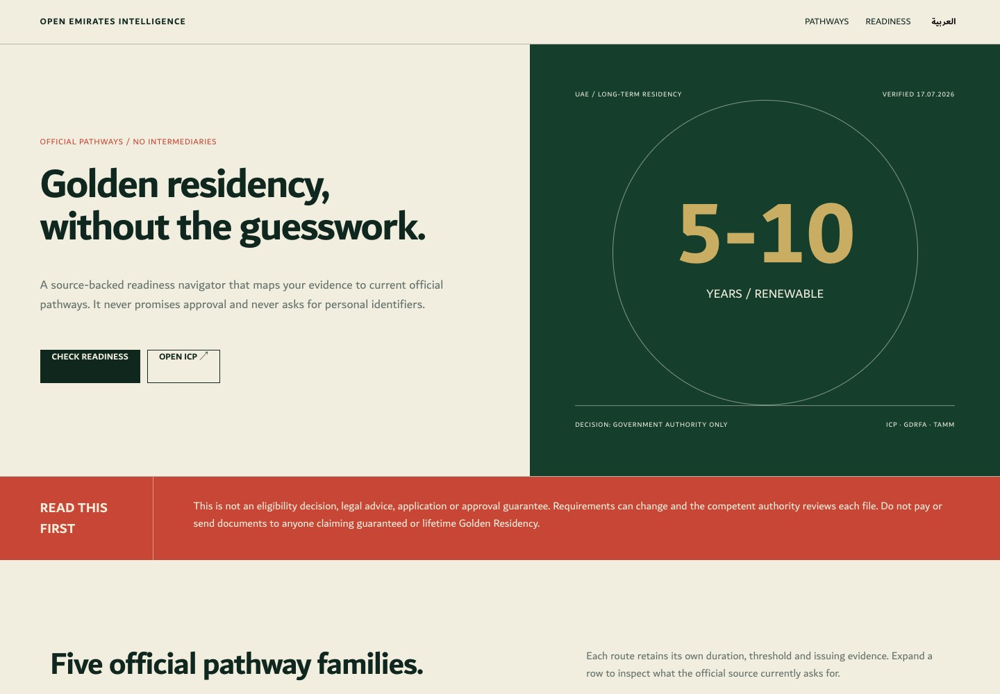</a></td>
    <td width="32%"><a href="https://uaemcp.zad.tools/golden-residency">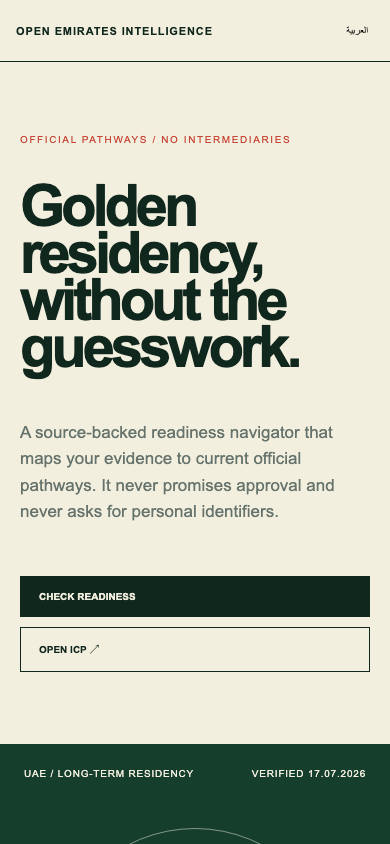</a></td>
  </tr>
</table>

<p align="center">
  <a href="https://uaemcp.zad.tools/education">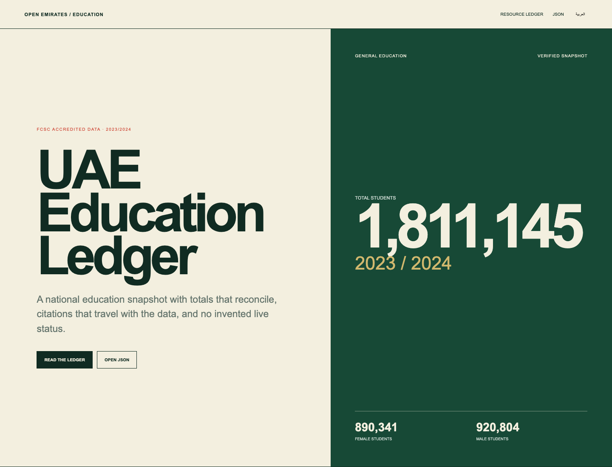</a>
</p>

<p align="center">
  <a href="https://uaemcp.zad.tools/health-indicators">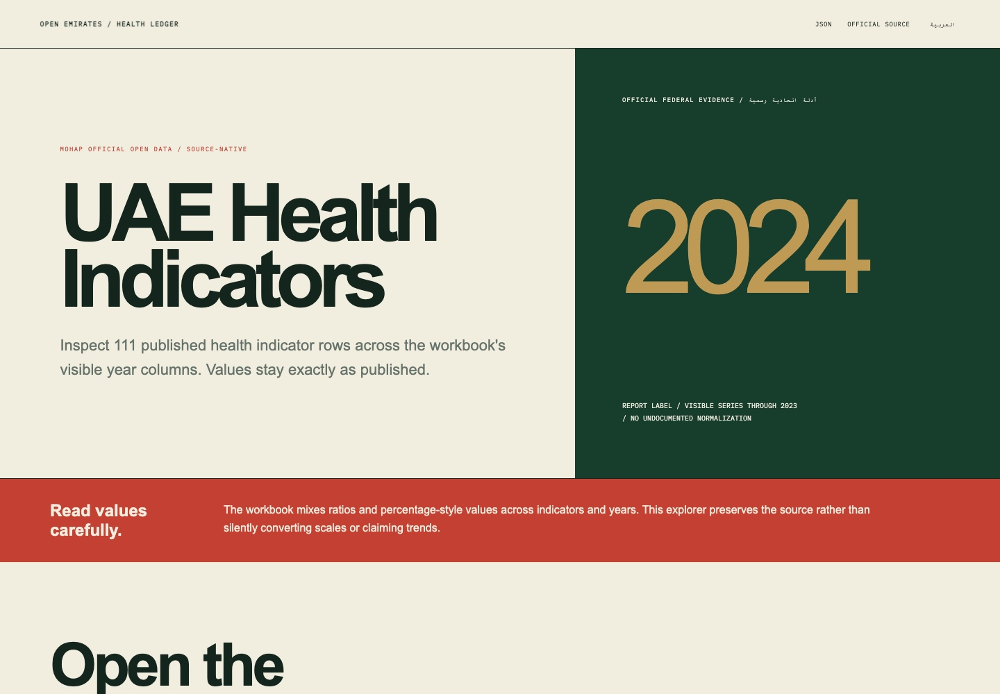</a>
</p>

<p align="center">
  <a href="https://uaemcp.zad.tools/observatory">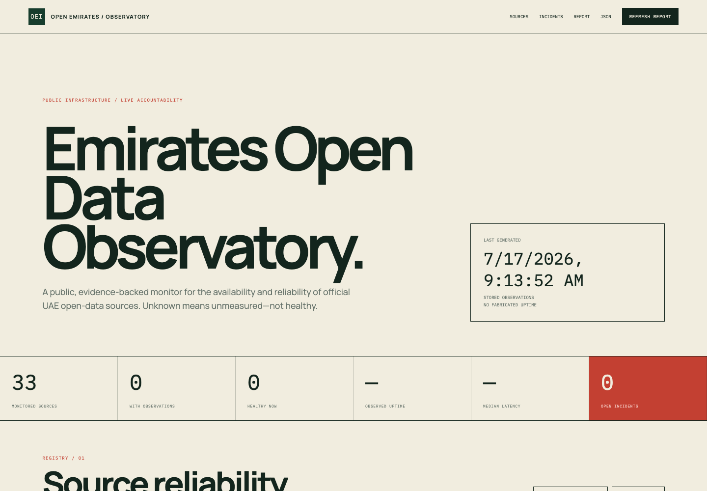</a>
</p>

<p align="center">
  <a href="https://uaemcp.zad.tools/industry-atlas">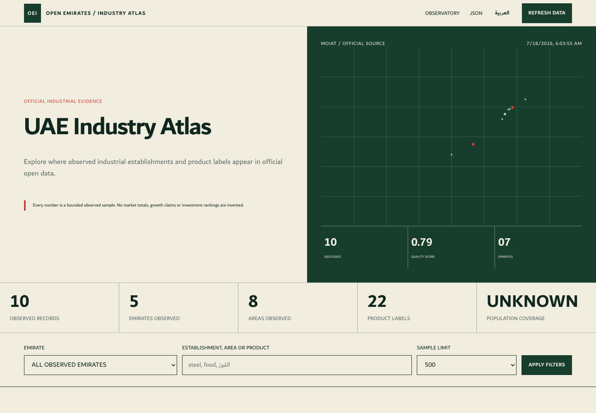</a>
</p>

<table>
  <tr>
    <td width="55%"><a href="https://uaemcp.zad.tools/trade-flow">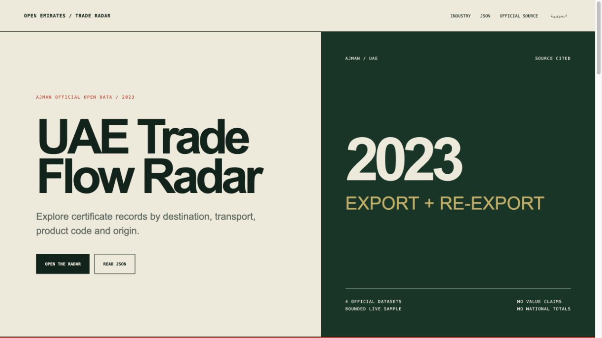</a></td>
    <td width="45%"><a href="https://uaemcp.zad.tools/trade-flow">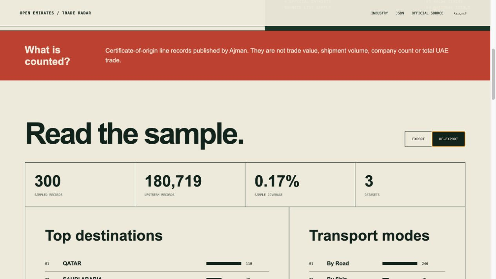</a></td>
  </tr>
</table>

<p align="center">
  <a href="https://uaemcp.zad.tools/tax-services">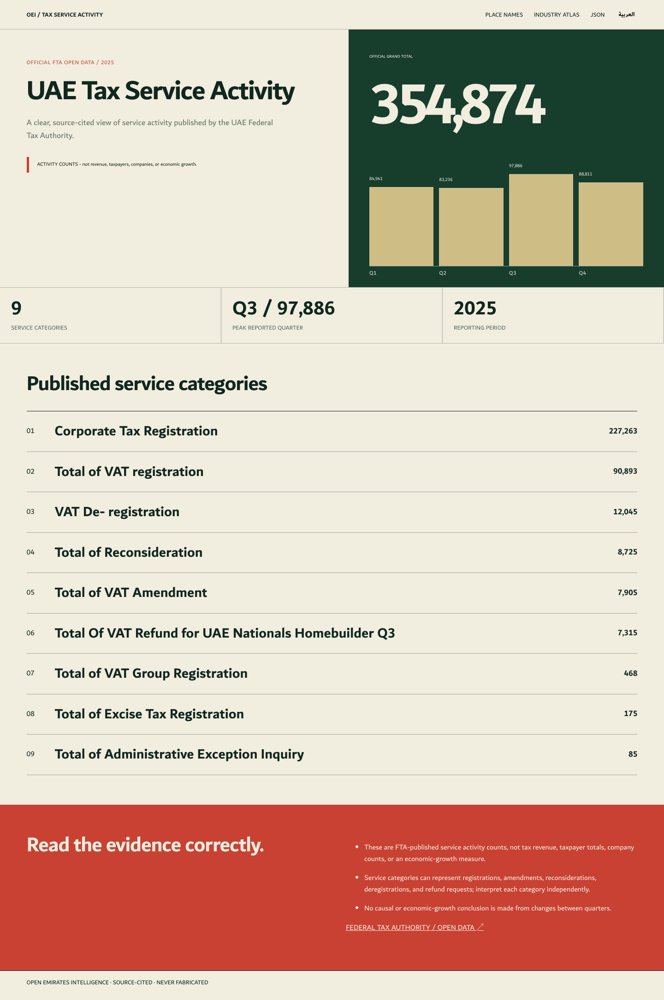</a>
</p>

<table>
  <tr>
    <td width="58%"><a href="https://uaemcp.zad.tools/tax-services/archive">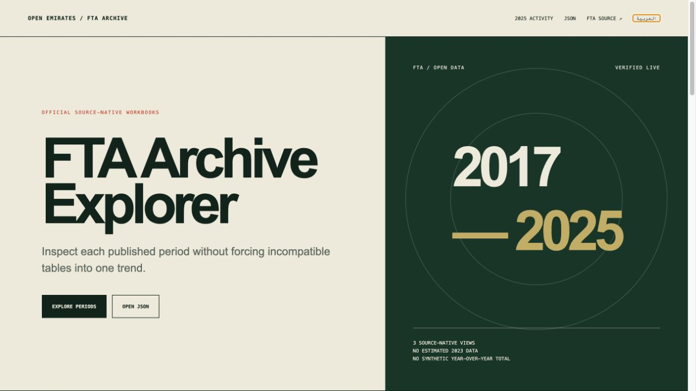</a></td>
    <td width="42%"><a href="https://uaemcp.zad.tools/tax-services/archive">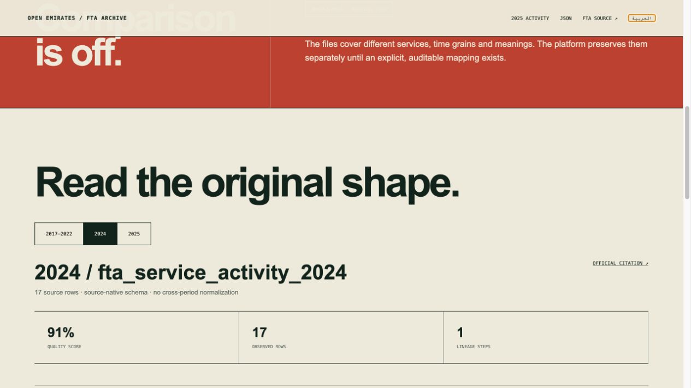</a></td>
  </tr>
</table>

<p align="center">
  <a href="https://uaemcp.zad.tools/places">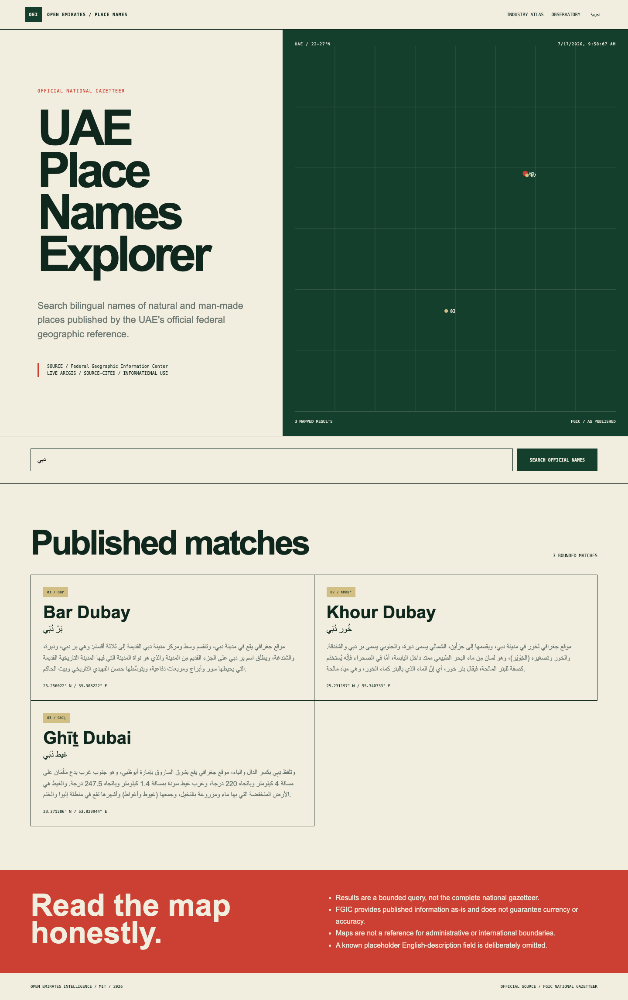</a>
</p>

## MCP client configuration

```json
{
  "mcpServers": {
    "uae-intelligence": {
      "command": "bun",
      "args": ["/absolute/path/to/uaemcp/src/index.ts", "stdio"]
    }
  }
}
```

## TypeScript SDK

The same Bun package includes a zero-dependency typed REST client:

```ts
import { UaemcpClient } from "uaemcp";

const uae = new UaemcpClient();
const matches = await uae.search("عقارات دبي", { deep: true });
const records = await uae.records("moiat_industrial_licenses", { limit: 10 });
```

Point `baseUrl` at the hosted endpoint or any self-hosted instance. Structured
API failures throw `UaemcpClientError` with the HTTP status and public error code.

## Generated SDKs

The repository also ships generated clients for Python, Go, Rust, Java and C#
under [`sdk/`](sdk/). All clients are generated from the live OpenAPI 3.1
contract at `/openapi.json`:

```bash
bun run generate:sdks
bun run check:sdks
```

The second command fails when an API change has not been propagated to every
language. It is included in the main release check.

## MCP tools

<p align="center">
  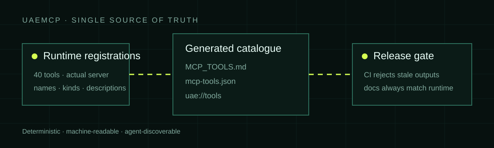
</p>

The authoritative tool catalogue is generated directly from the registered
runtime, so names, descriptions and access kinds cannot silently drift from the
server:

- [Readable catalogue](docs/MCP_TOOLS.md)
- [Machine-readable catalogue](docs/mcp-tools.json)
- MCP resource: `uae://tools`
- [Public bilingual MCP Developer Console](https://uaemcp.zad.tools/tools) (also `/mcp/tools`) with schemas, examples, safe Try-it and client configuration
- REST contracts: `GET /api/v1/tools` · `GET /api/v1/tools/{toolName}` · `POST /api/v1/tools/{toolName}/call`

```bash
bun run generate:tools
bun run check:tools
```

The second command is part of the release gate and fails when either generated
catalogue is stale.

FTA archive REST mirror: `GET /api/v1/tax-services/archive`. It returns the
2017–2022 selected-services table, the source-native 2024 monthly table, and the
2025 quarterly table as separate cited views. `comparison.status` is
`unavailable`: 2023 is missing and the published scopes and schemas are not
equivalent, so UAEMCP does not manufacture a trend or annual total.

## Unified catalog and coverage

The project does not present every indexed portal as live data. Use:

- `GET /api/v1/coverage` for live, blocked, key-required and metadata-only totals.
- `GET /api/v1/catalog` for explicit portal, organization, connector, license and capability models.
- `GET /.well-known/uaemcp.json` for the operator and trust manifest.
- `GET /api/v1/sources/{sourceId}/schema` or `uae_dataset_schema` before aggregation.
- `GET /api/v1/sources/{sourceId}/health-history` for uptime and latency history.
- `GET|POST /api/v1/sources/{sourceId}/snapshots` and `GET /api/v1/snapshots/diff` for dataset history.
- `GET /api/v1/intelligence/recipes` to discover analytical recipes and run them by id.

Current conservative coverage is 48 official sources indexed, 16 live record
connectors, at least 222 known queryable datasets, 1 blocked connector, and 3
key-required portals. Counts never imply
that metadata-only portals are queryable.

One live connector is the official FGIC National Gazetteer. It exposes
bilingual UAE place names and coordinates through ArcGIS while omitting a known
placeholder English-description field and retaining FGIC's informational-use disclaimer:

<p align="center">
  <a href="https://uaemcp.zad.tools/places">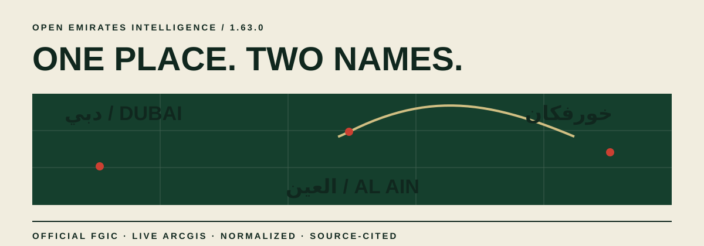</a>
</p>

```bash
curl 'https://uaemcp.zad.tools/api/v1/places?q=%D8%AF%D8%A8%D9%8A&limit=5'
```

Tool results use `{ ok, data, error, meta }`. Data responses include source,
license, citation, fetch time, completeness, sample coverage, source trust,
freshness, schema stability, record-count trend and a composite quality score.
Unknown measurements stay explicitly `unknown` until history can prove them.

## Configuration

| Variable | Default | Meaning |
| --- | --- | --- |
| `UAEMCP_HOST` | `127.0.0.1` | HTTP bind host |
| `UAEMCP_PORT` | `8080` | HTTP port |
| `UAEMCP_WRITE_TOKEN` | unset | Enables the write tool |
| `UAEMCP_HTTP_TIMEOUT` | `8` | Upstream timeout in seconds |
| `UAEMCP_HEALTH_TIMEOUT` | `5` | Health timeout in seconds |
| `UAEMCP_CACHE_TTL` | `300` | Dashboard cache TTL in seconds |
| `UAEMCP_MAX_RESPONSE_BYTES` | `5242880` | Maximum upstream response size |
| `UAEMCP_ALLOW_PRIVATE_HOSTS` | `false` | Allow private upstream hosts |
| `UAEMCP_ALLOWED_HOSTS` | unset | Comma-separated public host allowlist |
| `UAEMCP_ALLOWED_ORIGINS` | unset | Browser origin allowlist; use `*` only for fully public reads |
| `UAEMCP_RATE_LIMIT_PER_MINUTE` | `120` | Per-client public request limit; `0` disables it |
| `UAEMCP_DATABASE_PATH` | `data/uaemcp.sqlite` | Durable health-history and snapshot database |
| `UAEMCP_HEALTH_RETENTION` | `10000` | Maximum stored health checks per source |
| `UAEMCP_HEALTH_SCAN_INTERVAL_MINUTES` | `0` | Periodic Observatory scan; hosted deployment uses `60` |
| `UAEMCP_SNAPSHOT_RETENTION` | `30` | Maximum changed snapshots per source/dataset |
| `UAEMCP_SNAPSHOT_INTERVAL_MINUTES` | `0` | Snapshot schedule; `0` disables it |
| `UAEMCP_SNAPSHOT_TARGETS` | unset | Comma-separated `source` or `source@dataset` targets |
| `UAEMCP_SNAPSHOT_LIMIT` | `100` | Records captured per scheduled target |
| `UAEMCP_EMBEDDING_ENDPOINT` | unset | Optional OpenAI-compatible `/embeddings` endpoint for hybrid reranking |
| `UAEMCP_EMBEDDING_MODEL` | `text-embedding-3-small` | Embedding model sent to that endpoint |
| `UAEMCP_EMBEDDING_API_KEY` | unset | Optional bearer token for the embedding endpoint |

The scheduler starts with the HTTP server, runs immediately and then at the
configured interval. Identical payloads are deduplicated. Inspect its state at
`GET /api/v1/operations/snapshot-scheduler`.

## Hosted public proxy

The same server can be offered as a public MCP endpoint for users who cannot
self-host. Put it behind Nginx using [`deploy/nginx.conf`](deploy/nginx.conf),
set the public host/origin allowlists, keep write tools disabled, and expose:

```text
https://your-domain.example/mcp
```

The Nginx configuration disables buffering, caching, and compression on `/mcp`
so Streamable HTTP responses are not delayed or rewritten.

## Verify

```bash
bun run check
bun run benchmark
docker compose up --build
```

MIT licensed. See [CONTRIBUTING.md](CONTRIBUTING.md) and [SECURITY.md](SECURITY.md).
Connector authors should start with [docs/CONNECTORS.md](docs/CONNECTORS.md).
See [docs/API.md](docs/API.md), [docs/RECIPES.md](docs/RECIPES.md),
[docs/DEPLOYMENT.md](docs/DEPLOYMENT.md), [docs/FAQ.md](docs/FAQ.md), and the
[runnable examples](examples/README.md) for the complete developer path.
The security review is in [docs/THREAT_MODEL.md](docs/THREAT_MODEL.md), and the
evidence-backed release audit is in [docs/COMPLETENESS.md](docs/COMPLETENESS.md).
The requirement-by-requirement status is tracked in [docs/COMPLETENESS.md](docs/COMPLETENESS.md).
